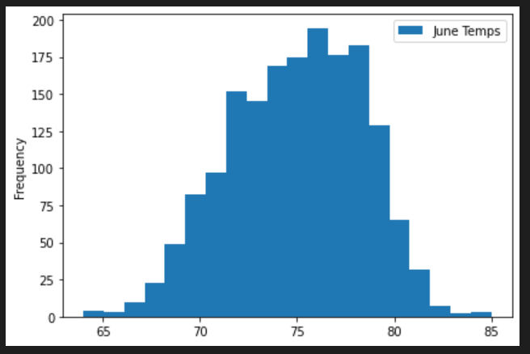

# Surfs Up

## Overview
The project is about the analysis of temperature trends in Oahu, Hawaii. Statistics of temperature data were requested for June and December because Avy wanted more information about temperature trends before opening the surf shop to determine if the surf and ice cream shop business is sustainable year-round.

## Resources
  - Data Tools: Python SQL toolkit (SQLAlchemy), Pandas, Numpy and ORM (Object Relational Mapping)
  - Web Server: Flask
  - DBMS: SQLlite
  - Data source: hawaii.sqlite

## Results

1. Summary statistics June and December temperatures (Oahu, Hawaii)

2. Temperature observations of June

4. Temperature observations of December
5. 
