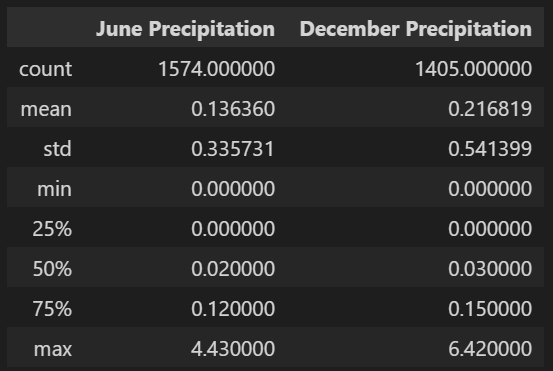

# Surfs Up

## Overview
The project is about the analysis of temperature trends in Oahu, Hawaii. Statistics of temperature data were requested for June and December because Avy wanted more information about temperature trends before opening the surf shop to determine if the surf and ice cream shop business is sustainable year-round.

## Resources
  - Data Tools: Python SQL toolkit (SQLAlchemy), Pandas, Numpy and ORM (Object Relational Mapping)
  - Web Server: Flask
  - DBMS: SQLlite
  - Data source: hawaii.sqlite

## Results
1. Summary statistics June and December temperatures (Oahu, Hawaii)

2. Temperature observations of June

3. Temperature observations of December

  1. Although the sample of June a December differs almost 11%, the average temperature differs 3.9 Fahrenheit degrees only.
  2. The most temperature frequencies are 76 and 71 degrees Fahrenheit in June and December, respectively. There is only a 5° F of difference between these months.
  3. The frequency temperatures range in June and December are between 68 and 75 degrees Fahrenheit. Although, the minimum temperature in June is 64 °F and 56 °F in December.

## Summary
According to the average and frequency of temperatures in June and December, we could conclude that December would still provide appropriate weather conditions for the surf and ice cream shop business because the temperature is fairly sustainable year-round. The frequency temperatures range in June and December are between 68° and 75° F, the average temperature differs 3.9° F only.

On the other hand, regarding precipitation data, we executed the following queries to know the trends about this weather issue

The Precipitations statistics outcomes getting from the queries showcases the following:

According to the average precipitation, December had the higher with 0.22 inches while June had 0.14 inches. The maximum precipitation in June was 4.4 inches while in December was 6.42 inches. In reference to the Intensity rain classification on the article https://en.wikipedia.org/wiki/Rain, rainfall intensity is classified according to the rate of precipitation, which depends on the considered time. So, we can conclude that in June and December in Oahu, Hawaii, there are on average moderate rains due to the precipitation rate being between 0.098 and 0.30 inches.
